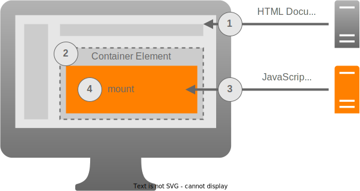

# Integration Contract

## Overview

With a growing number of host applications or microfrontends it becomes more important to standardize the way how they are integrated. This allows host applications to implement a generic solution to embed microfrontends. The approach should also be framework-agnostic so that teams can decide which libraries they want to use for building their applications.

Microfrontends should be deployable without having to deploy their host applications. The most general approach to make this happen is by hosting a separate JavaScript module which exports a _mount function_. Loading the microfrontend works as illustrated in the diagram below.



1. The browser requests the HTML document from the host application.
2. The web page of the host application includes a container element for the microfrontend.
3. The web page of the host application executes some JavaScript code to import a separate JavaScript module from the microfrontend server.
4. The web page of the host application calls the mount function exported by the JavaScript module and passes it a reference to the container element.

It is necessary that host applications and microfrontends agree on a standardized signature of the mount function and its behavior. The suggestion of this project template is described in the following sections.

:::info

This project template provides a TypeScript declaration for its mount function convention in the workspace `packages/mfe-contract`. You can import the type like this:

```ts
import type { MountFunction } from "mfe-contract";
```

:::

## Microfrontend Requirements

Each microfrontend must provide its own mount function which allows host applications to render it in their pages.

- The microfrontend provides a mount function as [default export](https://developer.mozilla.org/en-US/docs/Web/JavaScript/Reference/Statements/export) of a JavaScript module.
- The first parameter of the function is the container element where the microfrontend should be mounted.
- The second parameter of the function is an optional value to pass data from the host application to the microfrontend.
- The function must render the microfrontend inside the given container element when it is called.
- The function may return an object with two optional properties: `update` and `unmount`
- The `update` function (if present) can be called by the host application to update the data passed to the microfrontend. It is expected that the microfrontend updates its state accordingly.
- The `unmount` function (if present) can be called by the host application to remove the microfrontend from the page. It is expected the the microfrontend does necessary cleanup, e.g. remove event listeners.

## Host Application Requirements

Each host application must provide the foundation for loading and mounting microfrontends.

- The host application renders the container element inside the HTML document.
- The host application implements a loading mechanism to fetch the microfrontend JavaScript module as soon as it is required.
- The host application calls the mount function exported from the JavaScript module as soon as the separate JavaScript file has been loaded.
- The host application must pass a reference to the container element as first argument to the mount function.
- The host application may pass an optional value as second argument to the mount function in order to provide data to the microfrontend.
- The host application may keep the object returned by the mount function for as long as the entire page is not reloaded.
- The host application may call the `update` function (if present) in the returned object to pass new data to the microfrontend.
- The host application may call the `unmount` function (if present) in the returned object to remove the microfrontend from the page.
