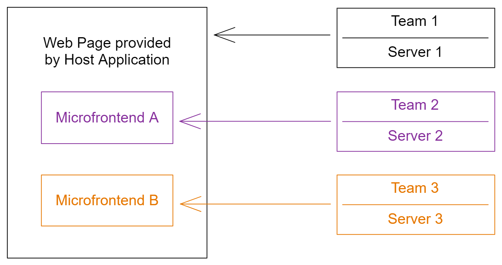

# Microfrontends

## Overview

[Microfrontends](https://micro-frontends.org/) is the concept of composing a web page from multiple parts which can be deployed independently. The goal is to avoid rebuilding and deploying the application rendering the HTML document when only the code of a certain page component needs to be updated. This approach can not only save server resources for larger applications but also enables development teams to ship features more independently.



In the diagram above, assume that the host application is providing the HTML document of the web application and is managed by team 1 which deploys that application to server 1. On some page inside the host application there are embedded mini apps which are mostly independent of each other. These mini apps can be integrated as microfrontends A and B, so that their dedicated teams 2 and 3 can deploy them on their own on server 2 and 3 respectively.

Whenever teams 2 and 3 want to update their mini app they should not have to request team 1 to redeploy their host application. Instead they simply deploy a new version of their microfrontends and browsers should fetch the updated resources when rendering the page of the host application.

## Approaches

All contemporary approaches to implement microfrontends rely on dynamically loading JavaScript code required for partial applications from sources which can be updated independently from the host application. In the context of web applications this typically means that browsers request a JavaScript file from a server which is managed separately from the host application.

### ES Modules and Import Maps

Modern JavaScript supports importing code from remote sources. This is what we are going to use in this project template.

```js
// Static import (works only inside <script type="module">)
import React from "https://esm.sh/react@18.2.0";

// Dynamic import (works in any context)
import("https://esm.sh/react@18.2.0").then(({ default: React }) => {});
```

To resolve bare module specifiers like `"react"` the host application must define an [import map](https://developer.mozilla.org/en-US/docs/Web/HTML/Element/script/type/importmap).

```html
<script type="importmap">
  {
    "imports": {
      "react": "https://esm.sh/react@18.2.0"
    }
  }
</script>
<script type="module">
  // Works only with import map
  import React from "react";
</script>
```

[Module imports are supported very well](https://caniuse.com/mdn-javascript_statements_import) in browsers these days. However, [import maps have only landed recently](https://caniuse.com/import-maps) in Firefox and Safari, so they might not be available to all users yet.

You can include [es-module-shims](https://github.com/guybedford/es-module-shims) in your host applicaton to polyfill import maps.

### Module Federation

[Webpack](https://webpack.js.org/) - a popular module bundler - introduced the concept of [module federation](https://webpack.js.org/concepts/module-federation/). It is a proprietary solution requiring special plugins in the build processes of host applications and microfrontends.

Simplified, the builds of microfrontends generate special JavaScript bundles which can be loaded dynamically by the JavaScript code generated in the host application bundles. These host bundles incorporate a special loading mechanism which loads the microfrontend bundles from their remote sources as soon as they are required by the code.

There are plugins to make module federation work with other tools and frameworks.

- [Vite plugin](https://www.npmjs.com/package/@originjs/vite-plugin-federation) for usage with Vite and even compatible with Webpack format.
- [Next.js](https://www.npmjs.com/package/@module-federation/nextjs-mf) plugin is built on top of the Webpack plugin and supports server-side rendering.

### Composition Frameworks

Some frameworks attempt to make the setup easier and solve specific challenges. However, they may be too much for simpler projects but are a great resource for learning.

- [single-spa](https://single-spa.js.org/) orchestrates multiple SPAs within one host application and provides additional tooling for special use cases. Its article about the [recommended setup](https://single-spa.js.org/docs/recommended-setup) is fantastic to understand basic concepts.
- [qiankun](https://qiankun.umijs.org/) is another composition framework which is built on top of single-spa.
