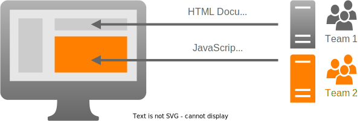

# Microfrontends

## Overview

[Microfrontends](https://micro-frontends.org/) is the concept of composing a web page from smaller frontend applications which can be deployed independently. The goal is to avoid rebuilding and deploying applications which have not changed and enabling separate teams to work on dedicated application parts independently with tools and frameworks of their choice.



In the diagram above, assume that the HTML document of the web application is provided by an application developed by team 1. On the web page there is a partial application developed by team 2. This partial application can be integrated as a microfrontend so that team 2 can deploy changes without having to ask team 1 to deploy their web application.

## Approaches

Composition of the web page can be performed server-side or client-side.

- **Server-side composition** works by processing HTML documents with a special server application before they are sent to the browser. Such an application can perform server-side includes allowing one application to provide a document with placeholders and filling these gaps with content retrieved from other applications. While this may be a viable solution for mainly static content it is out of scope for this project template.
- **Client-side composition** works by processing HTML documents directly in the browser. One application - we call it the host application - serves the HTML document including some JavaScript code to dynamically load external JavaScript files required for partial applications and runs their code. These external microfrontend files can be updated independently. Such approaches are more suitable for highly interactive microfrontends and this project template focuses on this technique.

### ES Modules and Import Maps

Modern JavaScript supports [importing modules](https://developer.mozilla.org/en-US/docs/Web/JavaScript/Reference/Statements/import) from remote sources. This is what we are going to use in this project template.

```js
// Static import (works only inside <script type="module">)
import React from "https://esm.sh/react@18.2.0";

// Dynamic import (works in any context)
import("https://esm.sh/react@18.2.0").then(({ default: React }) => {});
```

To resolve bare module specifiers like `"react"` the host application must define an [import map](https://developer.mozilla.org/en-US/docs/Web/HTML/Element/script/type/importmap).

```html
<script type="importmap">
  {
    "imports": {
      "react": "https://esm.sh/react@18.2.0"
    }
  }
</script>
<script type="module">
  // Works only with import map
  import React from "react";
</script>
```

[Module imports are supported very well](https://caniuse.com/mdn-javascript_statements_import) in browsers these days. However, [import maps have only landed recently](https://caniuse.com/import-maps) in Firefox and Safari, so they might not be available to all users yet.

You can include [es-module-shims](https://github.com/guybedford/es-module-shims) in your host applicaton to polyfill import maps.

### Module Federation

[Webpack](https://webpack.js.org/) - a popular module bundler - introduced the concept of [module federation](https://webpack.js.org/concepts/module-federation/). It is a proprietary solution requiring special plugins in the build processes of host applications and microfrontends.

Simplified, the builds of microfrontends generate special JavaScript bundles which can be loaded dynamically by the JavaScript code generated in the host application bundles. These host bundles incorporate a special loading mechanism which loads the microfrontend bundles from their remote sources as soon as they are required by the code.

There are plugins to make module federation work with other tools and frameworks.

- [Vite plugin](https://www.npmjs.com/package/@originjs/vite-plugin-federation) for usage with Vite and even compatible with Webpack format.
- [Next.js](https://www.npmjs.com/package/@module-federation/nextjs-mf) plugin is built on top of the Webpack plugin and supports server-side rendering.

### Composition Frameworks

Some frameworks attempt to make the setup easier and solve specific challenges. However, they may be too much for simpler projects but are a great resource for learning.

- [single-spa](https://single-spa.js.org/) orchestrates multiple SPAs within one host application and provides additional tooling for special use cases. Its article about the [recommended setup](https://single-spa.js.org/docs/recommended-setup) is fantastic to understand basic concepts.
- [qiankun](https://qiankun.umijs.org/) is another composition framework which is built on top of single-spa.
